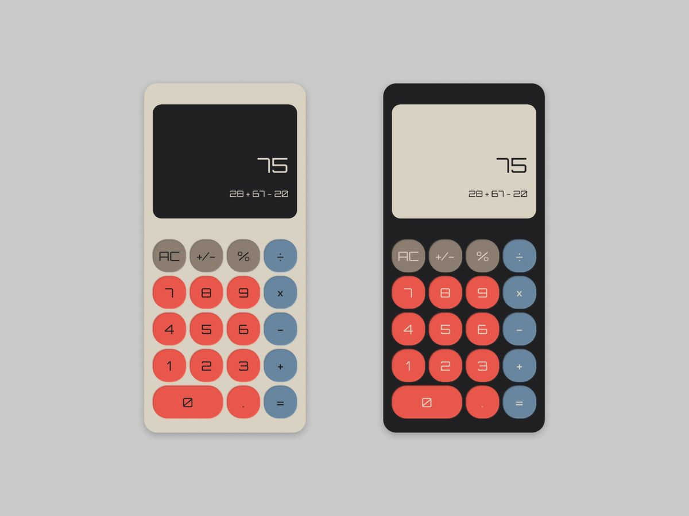
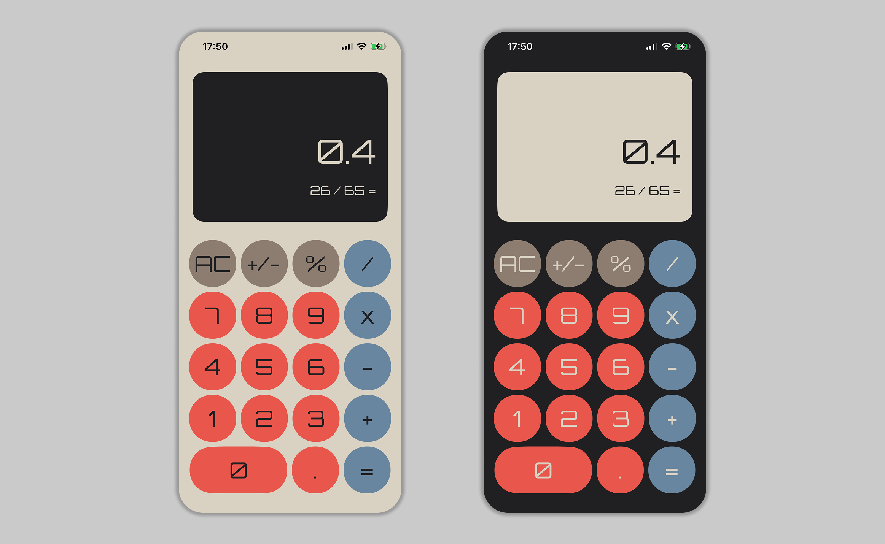

<div align="center">

# Calculator-iOS-App-SwiftUI

A minimalistic calculator for iOS, fully built with **SwiftUI** following a design reference from Pinterest.


</div>

---

## Design

The screen was built following a designer's reference from Pinterest:



Link to the original work: [pinterest.com/pin/736197870374877478](https://www.pinterest.com/pin/736197870374877478/)

## Result

And here's what it turned into:



## Features

- Fully declarative interface built with **SwiftUI**, no Storyboard/XIB
- Classic calculator layout — digits, `+` `-` `x` `/` `=`, `.`, `%`, `+/-`, `AC`
- An expression line above the result (e.g. "12 + 5") that updates as you type
- Adaptive button sizing calculated from screen width; the `0` button is double-width, just like in the stock Calculator
- A custom variable font, **Orbitron**
- A custom color palette via Color Assets (`appNumber`, `appSymble`, `appSpecialSymble`, `appBackground`, `appDisplay`, `appText`, `appCount`)

## Architecture & Stack

- **Swift 5.0**, **SwiftUI** — the whole screen is described declaratively, no storyboard
- **MVVM** — `ViewModelCalculator` as an `ObservableObject` with `@Published` state (`value`, `expression`, `currentOperation`)
- **Combine** — reactive View ↔ ViewModel binding via `@EnvironmentObject`
- All calculation logic (addition/subtraction/multiplication/division/percentage) lives in plain view model methods, with no third-party dependencies

## Getting Started

1. Clone the repository:
   ```bash
   git clone https://github.com/Empty-Developer/Calculator-iOS-App-SwiftUI.git
   ```
2. Open `Calculator/Calculator.xcodeproj` in Xcode and run it on a simulator/device with iOS 26+.

## License

This project is distributed under the [MIT](LICENSE) license.